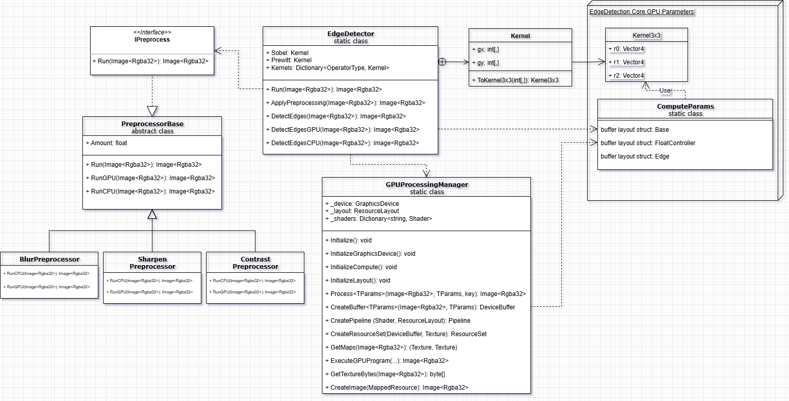

# Edge Detection

## Overview

This project implements a **modular image edge detection pipeline** with optional preprocessing and GPU acceleration.  
It allows detecting edges in images using **Sobel** or **Prewitt** operators, with support for **blur, sharpen, and contrast adjustments** prior to edge detection.

The GPU path is implemented using **Veldrid** and **DirectCompute shaders**, while CPU fallback ensures cross-compatibility.

---

## Features

- **Preprocessing:**
  - Gaussian Blur (`--blur`)
  - Sharpen (`--sharpen`)
  - Contrast Adjustment (`--contrast`)
- **Edge Detection:**
  - Sobel Operator
  - Prewitt Operator
- **Execution Modes:**
  - CPU fallback
  - GPU acceleration

---

## Usage
### Command-Line Mode
- EdgeDetection.CLI.exe --input <input_path> --output <output_path> --operator <Sobel|Prewitt> --forceCPU --blur --sharpen --contrast

### Parameters

| Argument    | Description                             |
|-------------|-----------------------------------------|
| `--input`   | Input image path (e.g., `.jpg`, `.png`) |
| `--output`  | Output image path                       |
| `--operator`| Edge operator: `Sobel` or `Prewitt`     |
| `--forceCPU`| (Optional) Disable GPU acceleration     |
| `--blur`    | (Optional) Gaussian blur amount (0-1)   |
| `--sharpen` | (Optional) Sharpen amount (0-1)         |
| `--contrast`| (Optional) Contrast adjustment (0-1)    |

---
### Interactive Mode (recommended for quick testing)
#### If you run the project directly from Visual Studio (using the "Run" button or F5), the application starts in interactive mode. You will be prompted step-by-step to enter:
- Input image path
- Output image path
- Edge detection operator (sobel / prewitt)
- Preprocessing options (blur, sharpen, contrast) space separated
- Force CPU fallback

## Project Structure

| Folder                  | Description                     |
|-------------------------|---------------------------------|
| `EdgeDetection.Core`    | Core logic, GPU/CPU pipelines   |
| `EdgeDetection.CLI`     | Command-line interface          |
| `EdgeDetection.Tests`   | Unit tests                      |
| `GPU.Compute (.hlsl)`   | Compute shaders (GPU pipeline)  |

---

## UML Class Diagram

---

## Unit Tests

Tests cover:

- Operator selection logic
- End-to-end image processing (sample data)

### Running Tests

Use **Visual Studio Test Explorer** or run: dotnet test

---

## GPU Shaders

All `.hlsl` compute shaders are compiled via `compile_hlsl.bat`.  
This script automatically compiles all shaders in the `/GPU/Compute` folder using `fxc`.

---

## Build & Run

- Requires **.NET 9.0** and **Windows (DirectCompute)**
- **Veldrid** for GPU backend
- **ImageSharp** for CPU-side image processing

---

## License

For educational purposes/assignment submission.